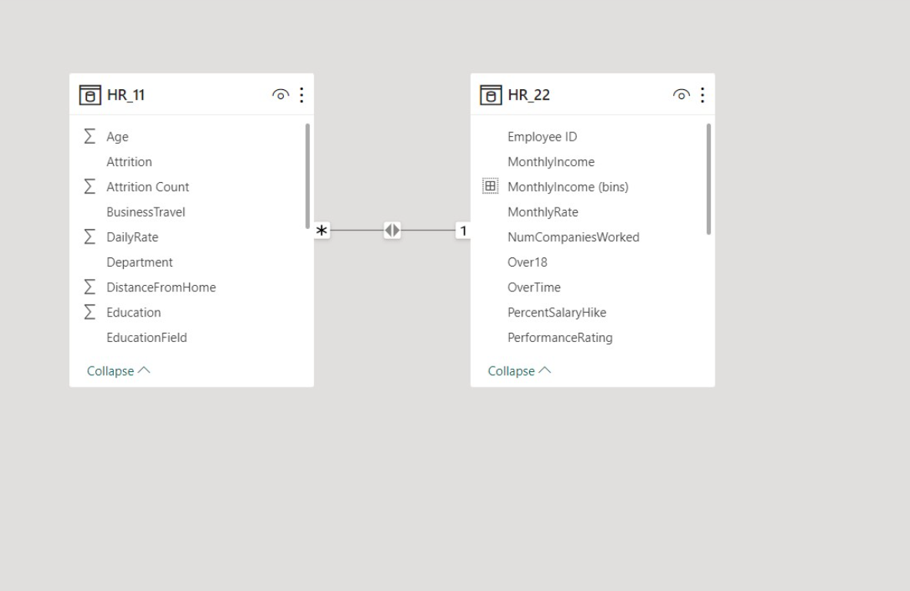
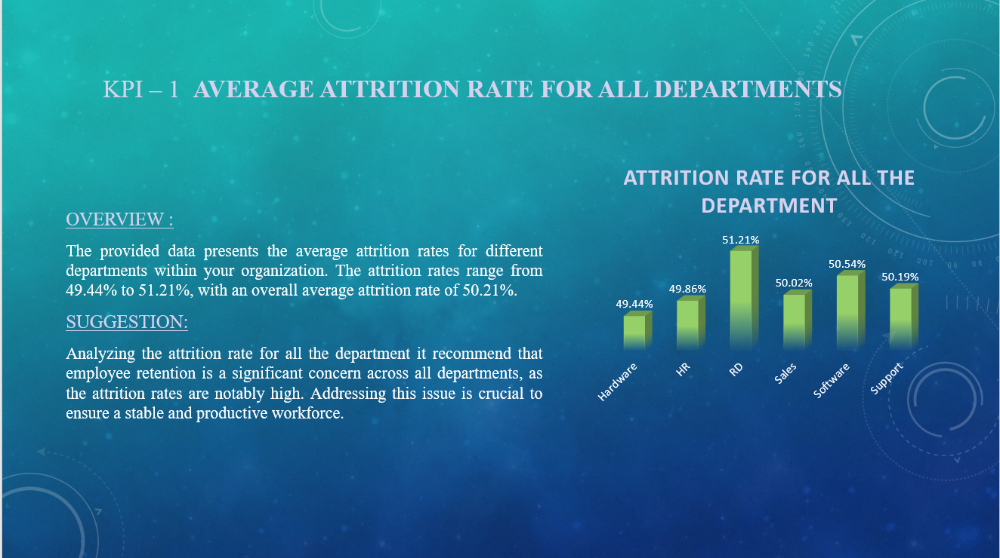
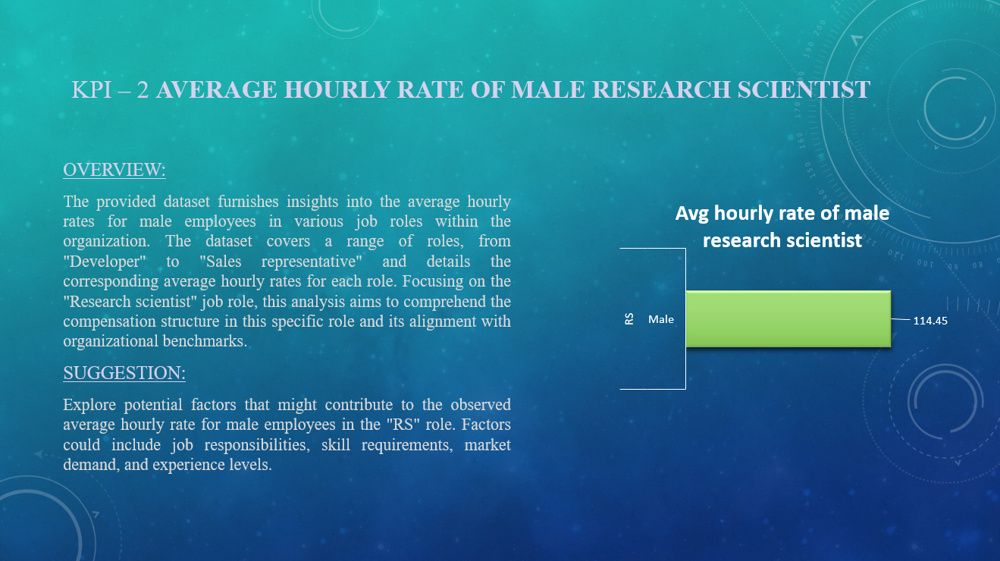
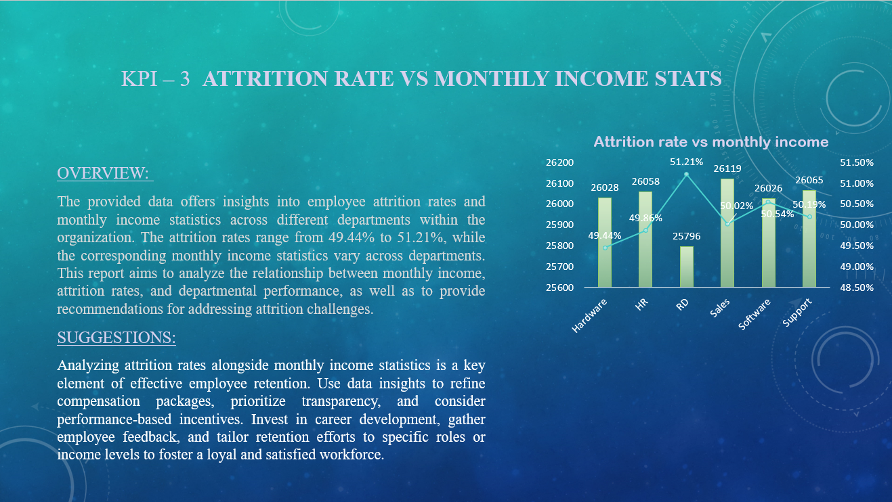
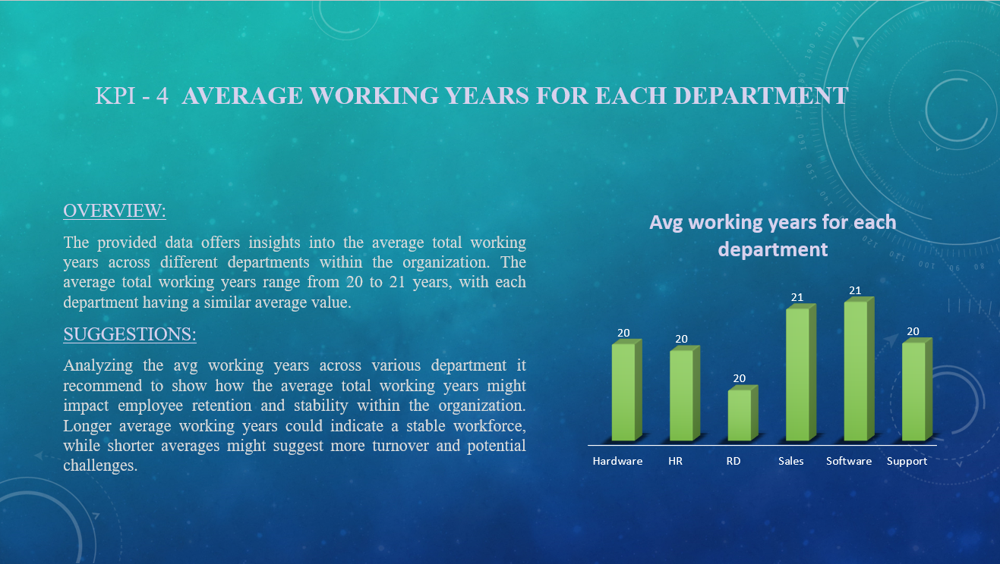
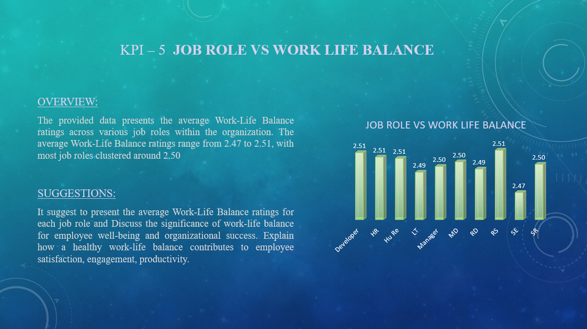
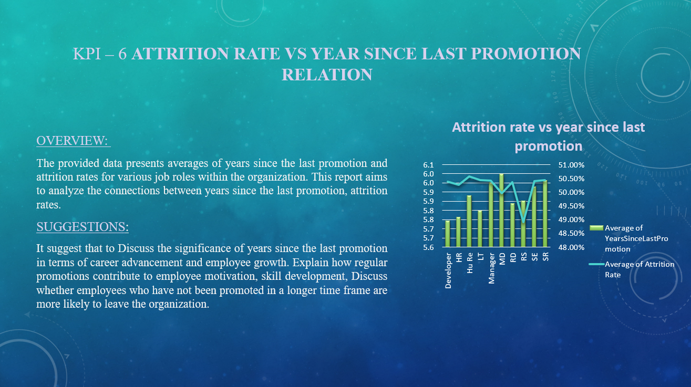
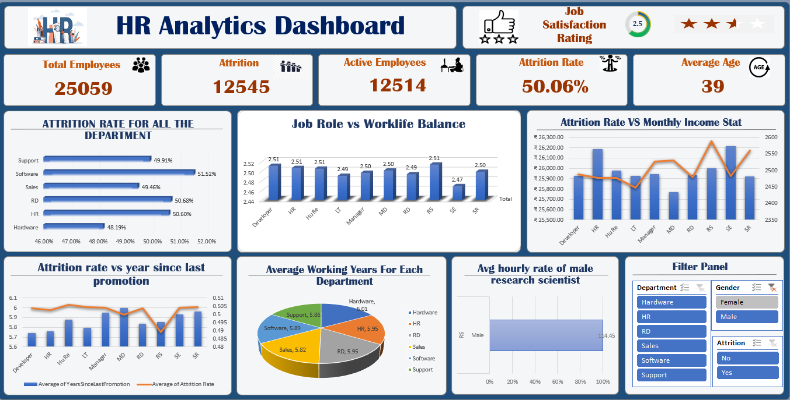
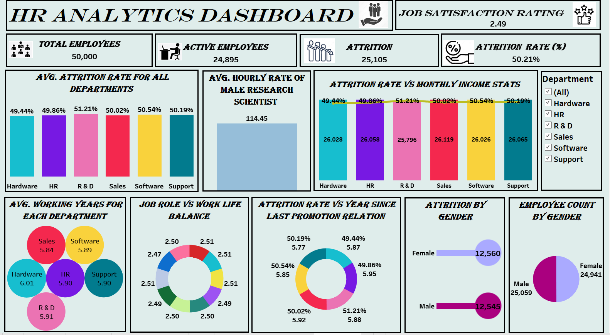
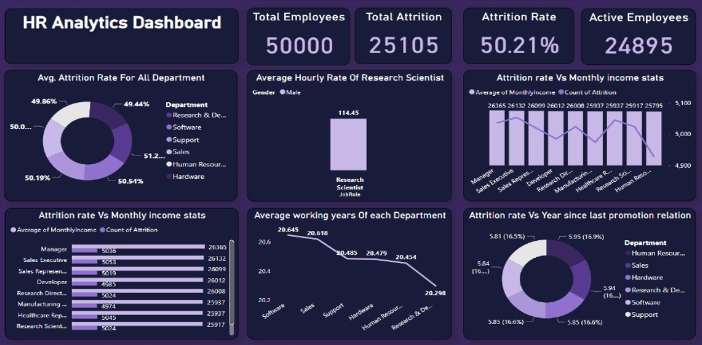

# HR-Attrition-Analysis

## Introduction

Welcome to our HR Attrition Analysis Project
This project aims to meticulously examine employee attrition patterns within the organization, providing valuable insights into the underlying factors contributing to turnover. By leveraging data analytics and predictive modeling, we intend to uncover actionable strategies to enhance employee retention and organizational stability. Join us in exploring the data-driven journey towards a more resilient and engaged workforce.

### Dataset

- Project Name: Employee Retention
- Dataset Name: HR_1 and HR_2
- Dataset Type: Excel Data
- Dataset Size: 50,000 records each

## Problem Statement

The key areas of analysis include:

- Average Attrition rate for all Departments.
- Average Hourly rate of Male Research Scientist.
- Attrition rate Vs Monthly income stats.
- Average working years for each Department.
- Job Role Vs Work life balance.
- Attrition rate Vs Year since last promotion relation.

## Skills/Concepts Demonstrated

This project demonstrates proficiency in:

- Data cleaning and preprocessing.
- Exploratory Data Analysis (EDA).
- Power BI (Bookmarking, DAX, Quick Measures, Modelling, Filters, Tooltips.)
- Statistical analysis to derive insights.
- MySQL (Joins, Group by, Having, Window Functions, View, Aggregate Functions.)
  
## Modelling

Built a Data Model using HR_1 and HR_2 as one to many relationship.

## KPI's Overview and Features 

1. Average Attrition Rate For All Department:

2. Average Hourly Rate of Male Research Scientist:

3. Attrition Rate Vs Monthly Income Stats:

4. Average Working Years For Each Department:

5. Job Role Vs Work Life Balance:

6. Attrition Rate Vs Year Since Last Promotion Relation:

## Visualization
1. Excel Dashboard

2. Tableau Dashboard

3. Power BI Dashboard

## Conclusion

Based on the analysis, the following conclusions can be drawn:

- Organization will be better equipped to make data-driven decisions to enhance employee retention efforts.
- The insights gained from the analysis will allow for more targeted and  effective interventions ultimately fostering a more satisfied and engaged workforce.
- Job satisfaction plays a significant role in attrition.
- Salary level is correlated with attrition rates.
- Employee performance ratings are linked to attrition.

## Recommendations

To reduce attrition, the following recommendations are suggested:

- Improve job satisfaction through targeted initiatives.
- Review and adjust salary levels where needed.
- Provide opportunities for skill development and career growth.
- Implement retention strategies for specific job roles.

# Future Work

To gain a deeper understanding of attrition patterns, future work may involve:

- Collecting more data over a longer period.
- Conducting employee surveys for qualitative insights.
- Implementing machine learning models for attrition prediction.

To gain a deeper understanding of attrition patterns, future work may involve:

- Collecting more data over a longer period.
- Conducting employee surveys for qualitative insights.
- Implementing machine learning models for attrition prediction.
